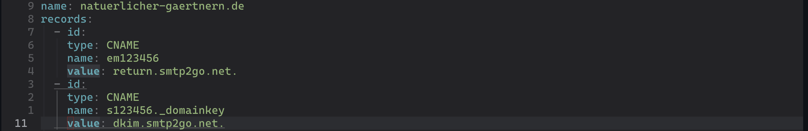
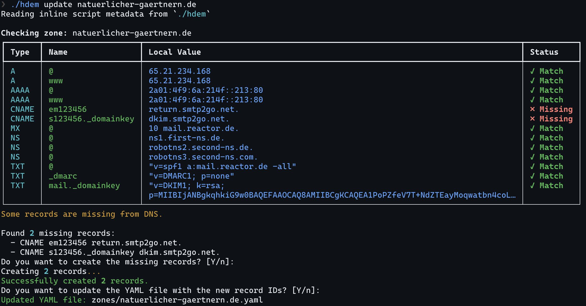

# Hetzner DNS Manager

A command-line tool to interact with the [Hetzner DNS API](https://dns.hetzner.com/api-docs), allowing you to manage DNS records.

Function scope is limited to managing records within existing zones for now.

## Features

- Import zones and records from the Hetzner DNS API
- Check DNS records against actual DNS entries
- Create missing and update mismatched DNS records
- Delete DNS records
- Stores zone data in YAML files for easy manual editing

## Example Workflow

After initial import, add records to a zone YAML file with empty ID:



Then run *update* to push the change to the API and update the YAML file with the new ID:



The same way you can update records and push those.

## Installation

The script uses [PEP 723](https://thisdavej.com/share-python-scripts-like-a-pro-uv-and-pep-723-for-easy-deployment/) for dependency management, so it's self-contained. You'll need Python 3.10 or higher and a working installation of [`uv`](https://docs.astral.sh/uv/), installed via your OS's package manager or via `pip`.

```bash
# Clone the repository
git clone https://github.com/serpent213/hetzner-dns-manager.git
cd hetzner-dns-manager
```

or

```bash
# Download raw script directly
curl -LO https://github.com/serpent213/hetzner-dns-manager/raw/refs/heads/master/hdem
chmod +x hdem
```

### Install from PyPI

Alternatively install from PyPI:

```bash
# Install using pip
pip install hetzner-dns-manager

# Or with pipx for isolated installation
pipx install hetzner-dns-manager
```

After installation, you'll have access to the `hdem` command in your terminal.

## Configuration

Set your Hetzner DNS API token as an environment variable:

```bash
export HETZNER_DNS_API_TOKEN="your_api_token_here"
```

You may want to add this to your shell profile file (`.bashrc`, `.zshrc`, etc.) for persistence.

## Usage

The database will be created in `./zones` and consists of one YAML file per zone.

### Import Zones and Records

Import a specific zone:

```bash
./hdem import example.com
```

Import all zones:

```bash
./hdem import --all
```

This will create YAML files in the `./zones` directory.

### Check DNS Records

Check a specific zone against actual DNS entries using one of the domain's authoritative servers:

```bash
./hdem check example.com
```

Check all zones:

```bash
./hdem check --all
```

SOA records will be ignored as they are updated automatically by Hetzner.

### Update DNS Records

Check and update mismatched records for a specific zone:

```bash
./hdem update example.com
```

Check and update mismatched records for all zones:

```bash
./hdem update --all
```

### Delete a DNS Record

Delete a specific record:

```bash
./hdem delete example.com www
```

## Data Structure

The YAML files in the `./zones` directory follow this structure:

```yaml
id: ZoneID
name: example.com
records:
  - id: RecordID1
    type: A
    name: www
    value: 192.0.2.1
  - id: RecordID2
    type: MX
    name: '@'
    value: '10 mail.example.com.'
```

## Related Projects

Some other tools dealing with the Hetzner DNS API (that are not dynamic DNS updaters):

- [A simple Hetzner DNS API client for Python and Bash](https://github.com/arcanemachine/hetzner-dns-tools)
- [Hetzner DNS CLI Tool](https://github.com/lanbugs/hdns_cli/)
